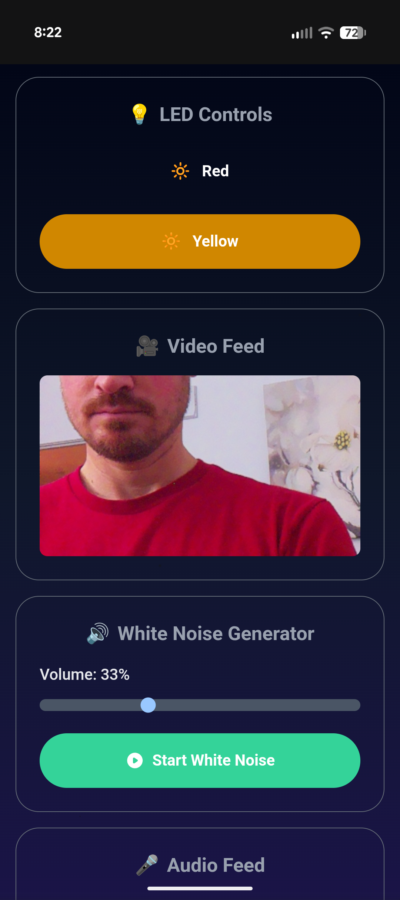

# Baby machine

Multi-purpose sound and light machine designed to run on [raspberry pi](https://www.raspberrypi.com/) with remote access via mobile-friendly interface.

[](https://github.com/psf/black)




## Features

### Frontend
- **Alpine.js** for reactivity
- **TailwindCSS** for responsive styling
- **Three LED Control Buttons** to toggle LEDs on/off
- **Video Feed** displaying live camera stream
- **Audio Feed** for monitoring microphone input
- **White Noise Generator** with volume slider control

### Backend (Flask Web Server)
- LED control endpoints for toggling LEDs
- Video streaming from camera
- Audio streaming from microphone
- White noise generation with adjustable volume


## Local Development (Testing on Laptop)

You can test the app locally on your Mac/PC before deploying to the Pi:

1. Install portaudio (required for pyaudio on macOS):
    ```bash
    brew install portaudio
    ```

2. Create and activate a virtual environment:
    ```bash
    python3 -m venv venv
    source venv/bin/activate
    ```

3. Install Python packages:
    ```bash
    pip install flask opencv-python numpy pyaudio
    ```

4. Run the app in dev mode:
    ```bash
    DEV_MODE=true python -m app
    ```

The app will automatically use your laptop's webcam and microphone instead of Pi hardware. If no camera is detected, a placeholder image will be shown.

## Setup on Rasberry Pi

1. SSH into the raspberry pi (`ssh pi@pi_ip_address`) or open a termial in the raspberry pi.


1. Update the pi and install system dependencies:
    ```bash
    sudo apt update
    sudo apt full-upgrade -y
    sudo apt install -y \
        python3.11-dev \
        python3-numpy \
        python3-opencv \
        python3-picamera2 \
        python3-pyaudio \
        alsa-utils \
        libopenblas-dev \
        build-essential \
        libjpeg-dev \
        libffi-dev \
        libssl-dev \
        ffmpeg
    ```

1. Copy the [deploy.sh](./deploy.sh) srcript to the pi and run it. 


1. Open a web browser and navigate to:
    ```
    http://localhost:3000
    ```

    Or from another device on the same network:
    ```
    http://<pi_ip_address>:3000
    ```

3. Use the web interface to:
   - Toggle LEDs on/off
   - View the video feed from the camera
   - Listen to the audio feed from the microphone
   - Control white noise generation and volume

## Raspberry Pi GPIO Setup

For LED control on Raspberry Pi, you'll need to:

1. Connect LEDs to GPIO pins (with appropriate resistors)
2. Modify `app.py` to include GPIO control code:

```python
import RPi.GPIO as GPIO

# Setup GPIO pins
LED_PINS = {
    'led1': 17,  # GPIO pin for LED 1
    'led2': 27,  # GPIO pin for LED 2
    'led3': 22   # GPIO pin for LED 3
}

GPIO.setmode(GPIO.BCM)
for pin in LED_PINS.values():
    GPIO.setup(pin, GPIO.OUT)
    GPIO.output(pin, GPIO.LOW)

# In the toggle_led function:
GPIO.output(LED_PINS[led_id], GPIO.HIGH if led_states[led_id] else GPIO.LOW)
```
